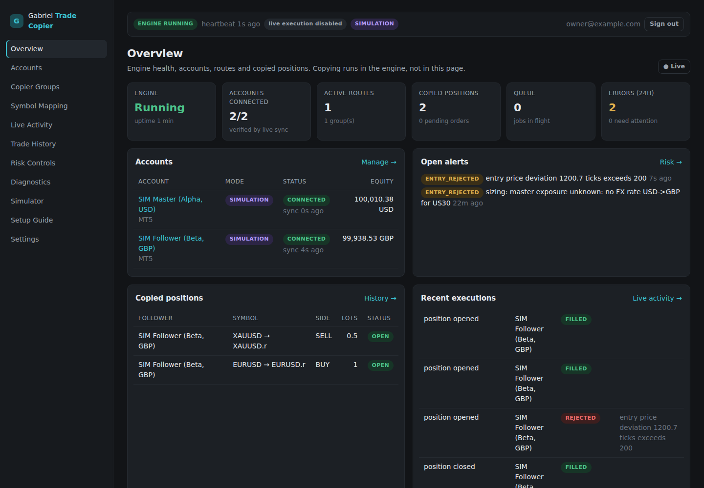

# Gabriel Trade Copier

A private, single-owner trade copier for copying **your own** trades across personal and
prop-firm accounts on **MT4, MT5, TradeLocker and Match-Trader**. Any supported platform can be a
master or a follower; routes can be cross-platform.

It copies trades according to explicit settings. It does not generate signals or make
discretionary decisions, and no AI model authorises, sizes, places, modifies or closes trades.

> **Status (honest summary).** The engine, dashboard, database, simulator and connectors are
> implemented and tested against **mocks, a simulator and a fake EA** (109 automated tests, plus a
> browser end-to-end run in SIMULATION). **No copying has been demonstrated on a real account
> yet.** TradeLocker and Match-Trader connectors and the MQL4/MQL5 bridges await demo access, and
> the EAs have not been compiled. Live execution is disabled by default. See
> [CHECKPOINT.md](CHECKPOINT.md), [docs/COMPATIBILITY.md](docs/COMPATIBILITY.md) and
> [docs/KNOWN_LIMITATIONS.md](docs/KNOWN_LIMITATIONS.md).

## Modes

| Mode | Meaning |
|---|---|
| **SIMULATION** | In-process simulated broker. No network, no platform. Proves logic only. |
| **DEMO ACCOUNT** | Real platform connectivity with a demo account. |
| **LIVE ACCOUNT** | Real money. Follower execution needs `LIVE_TRADING_ENABLED=true` *and* per-account arming. |

## Layout

```
apps/engine        Long-running copier (Node/TypeScript): adapters, watcher, router, executor,
                   reconciliation, risk, MT bridge endpoint
apps/web           Next.js dashboard (owner-only, Better Auth)
packages/shared    Types, schemas, sizing, symbol mapping, risk math, crypto, state machine
packages/db        Drizzle schema, migrations, durable job queue
packages/adapters  TradeLocker, Match-Trader, simulator adapters
bridges/mql4|mql5  Expert Advisor bridges for MetaTrader terminals
deploy/            Caddyfile (TLS)
docs/              Architecture, deployment, protocols, platform notes, test results
```

## Quick start (local, simulation)

Needs Node 22+, Docker Desktop (running) and Git. On Windows, run these from Git Bash.

```bash
./setup.sh    # once: installs dependencies, writes .env with fresh secrets, starts PostgreSQL
              # in Docker, applies migrations, creates your login, seeds simulated accounts
./start.sh    # every time: engine + dashboard → http://localhost:3000 (Ctrl+C stops both)
```

Both scripts are safe to re-run. The database runs in the `gtc-db` container
(`docker stop gtc-db` to stop it). To do the steps by hand instead:

```bash
pnpm install
cp .env.example .env && pnpm keys:generate       # paste generated values into .env
# set DATABASE_URL (PostgreSQL 16) and BETTER_AUTH_URL=http://localhost:3000 in .env, then:
set -a; . ./.env; set +a
pnpm db:migrate && pnpm owner:create && pnpm sim:seed
pnpm dev:engine        # terminal 1
pnpm dev:web           # terminal 2 → http://localhost:3000
```

Production: `docker compose up -d --build` — see [docs/DEPLOYMENT.md](docs/DEPLOYMENT.md).
MetaTrader terminals: [docs/WINDOWS_VPS.md](docs/WINDOWS_VPS.md).

## Documentation

- [Architecture](docs/ARCHITECTURE.md) — data flow, state machine, recovery, sizing, risk
- [Deployment & local development](docs/DEPLOYMENT.md)
- [Windows VPS & EA installation](docs/WINDOWS_VPS.md)
- [Bridge protocol](docs/BRIDGE_PROTOCOL.md) · [Interfaces](docs/API.md) · [Security](docs/SECURITY.md)
- Platforms: [TradeLocker](docs/platforms/tradelocker.md) · [Match-Trader](docs/platforms/matchtrader.md) · [MT4/MT5](docs/platforms/metatrader.md)
- [Compatibility matrix](docs/COMPATIBILITY.md) · [Known limitations](docs/KNOWN_LIMITATIONS.md)
- [Test results](docs/TEST_RESULTS.md) · [Demo validation procedure](docs/DEMO_VALIDATION.md)
- [CHECKPOINT](CHECKPOINT.md) — completed work, blockers, next action


